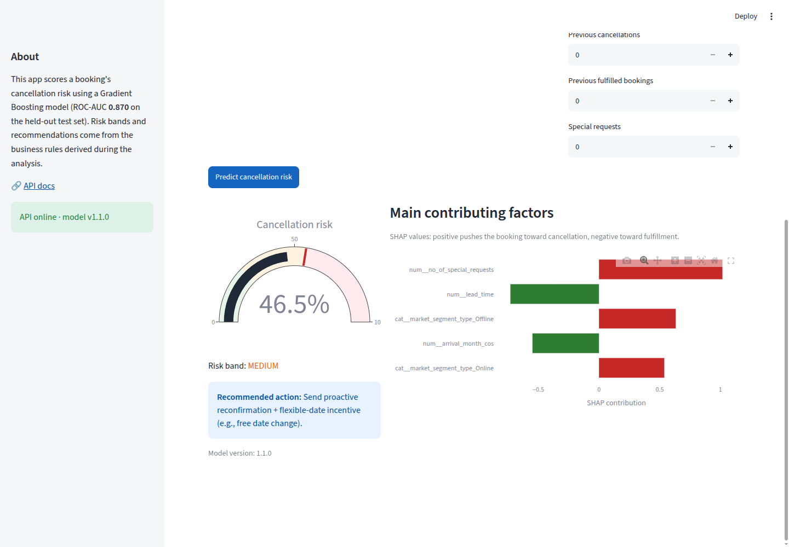
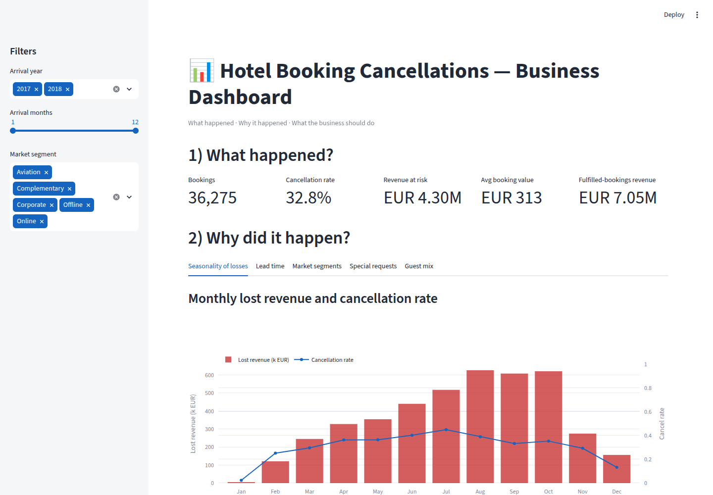
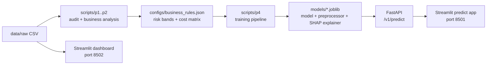

# Hotel Booking Cancellations Prediction

End-to-end machine learning project that predicts hotel booking cancellations to reduce revenue
loss from last-minute cancellations and enable proactive overbooking and inventory management.

The repository covers the full lifecycle: business analysis, feature engineering, model training
with a time-based split, a SHAP-explained prediction API, an operational scoring app, a business
dashboard, and Docker deployment — with tests and CI.


## Results

| Metric | Validation (Aug–Oct 2018) | Test (Oct–Dec 2018, single evaluation) |
| --- | --- | --- |
| ROC-AUC | 0.923 | **0.870** |
| PR-AUC | 0.923 | **0.748** |
| Recall @ threshold 0.035 | 0.989 | **0.943** |
| Precision @ threshold 0.035 | 0.614 | 0.535 |

The decision threshold (0.035) is optimized for a 10:1 cost ratio: a missed cancellation costs
~10x more than an unnecessary retention action, so the model trades precision for recall.
Details in the [model report](docs/model_report.md) and [model card](docs/model_card.md).

## Screenshots

| Predict app | Business dashboard |
| --- | --- |
|  |  |

## Dataset

- File: `data/raw/hotel_reservations.csv` (36,275 bookings, 19 columns — included in the repo)
- Source: [Hotel Reservations dataset (Kaggle)](https://www.kaggle.com/datasets/ahsan81/hotel-reservations-classification-dataset)
- Bookings arriving 2017–2018: guest counts, stay length, lead time, market segment, room type,
  average price, and final booking status (32.8% canceled).
- Re-download from the source at any time with `make download-data` (uses `kagglehub`).

## Architecture



## Quickstart

```bash
make setup              # create virtualenv and install pinned requirements
make test               # run the test suite (data and model artifacts are included)

# Full stack in Docker (no setup needed):
make docker-up          # api:8000, predict-app:8501, dashboard:8502
make docker-down
```

Local development (each in a separate terminal):

```bash
make run-api            # FastAPI on :8000 — interactive docs at /docs
make run-predict-app    # Streamlit scoring app on :8501
make run-dashboard      # Streamlit business dashboard on :8502
```

Reproduce the full pipeline from scratch:

```bash
make data-audit         # data audit + data dictionary
make business-analysis  # five business questions with charts and metrics
make train              # baseline, candidate models with CV, threshold, single test evaluation
```

## Project structure

```
data/raw                      dataset (committed for instant reproducibility)
configs/                      model config and business rules (risk bands, cost matrix)
scripts/                      analysis and training pipeline (p1 audit, p2 analysis, p4 ML)
src/api/                      FastAPI prediction service (schemas, SHAP explainer, serving)
src/features/                 shared feature engineering (train/serve consistency)
apps/predict_app/             Streamlit app: single + batch scoring
apps/dashboard/               Streamlit business dashboard
models/                       persisted model artifacts + metadata
tests/                        pytest suites (data, model, API)
docs/                         reports, data dictionary, API examples, images
```

## Key documents

- [Problem statement](docs/problem_statement.md)
- [Data dictionary](docs/data_dictionary.md) · [Data quality report](docs/data_quality_report.md)
- [Business analysis report](docs/business_analysis_report.md)
- [Model report](docs/model_report.md) · [Model card](docs/model_card.md)
- [API documentation](docs/api_documentation.md)
- [Predict app documentation](docs/predict_app_documentation.md)
- [Dashboard documentation](docs/dashboard_documentation.md)
- [Deployment documentation](docs/deployment_documentation.md)

## Methodology highlights

- **Time-based split** ordered by arrival date (train the past, score the future) — the dataset
  has no booking-creation timestamp, so arrival date is the best temporal proxy.
- **No leakage:** the preprocessing pipeline is re-fit inside every cross-validation fold, and the
  test set is evaluated exactly once.
- **Cost-aligned decision threshold:** optimized on the validation set by minimizing expected cost
  with the FN:FP = 10:1 matrix, then mapped to graded risk bands with recommended actions.
- **Train/serve consistency:** the API and the training pipeline share the same feature
  engineering module (`src/features/build_features.py`).
- **Explainability:** SHAP TreeExplainer served per prediction (top-k contributing factors).

## License

[MIT](LICENSE)
