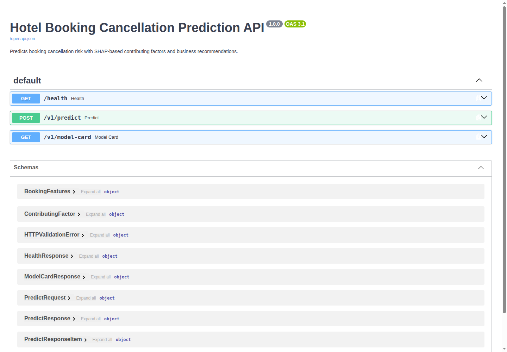

# API Documentation — Prediction Service

Base URL (local): `http://localhost:8000` · Interactive docs: `http://localhost:8000/docs`



## Endpoints

### `GET /health`

Liveness probe with model version.

```json
{"status": "ok", "model_version": "1.1.0", "model_name": "GradientBoostingClassifier"}
```

### `POST /v1/predict`

Predicts cancellation risk for 1–100 bookings.

**Request body:** `{"bookings": [ <BookingFeatures>, ... ]}`

`BookingFeatures` fields (all required, validated by Pydantic):

| Field | Type | Constraints |
| --- | --- | --- |
| no_of_adults | int | 0–10 |
| no_of_children | int | 0–10 |
| no_of_weekend_nights | int | 0–10 |
| no_of_week_nights | int | 0–30 |
| type_of_meal_plan | enum | Meal Plan 1/2/3, Not Selected |
| required_car_parking_space | 0/1 | — |
| room_type_reserved | enum | Room_Type 1–7 |
| lead_time | int | 0–500 |
| arrival_year / arrival_month / arrival_date | int | 2015–2030 / 1–12 / 1–31, valid calendar date |
| market_segment_type | enum | Online, Offline, Corporate, Complementary, Aviation |
| repeated_guest | 0/1 | — |
| no_of_previous_cancellations | int | 0–100 |
| no_of_previous_bookings_not_canceled | int | 0–100 |
| avg_price_per_room | float | 0–1000 (EUR) |
| no_of_special_requests | int | 0–10 |

Business rules enforced with 422: at least one guest, at least one night, valid calendar dates.

**Response (per booking):**

- `predicted_probability` — cancellation probability [0, 1]
- `predicted_label` — Canceled / Not_Canceled at the model threshold (0.035)
- `risk_band` — low / medium / high (from `configs/business_rules.json`); the low band is
  delimited by the same threshold, so label and band are always consistent
- `recommendation` — business action for the band
- `contributing_factors` — top-5 SHAP contributions (positive = pushes toward cancellation)
- `model_version`, `timestamp`

**Errors:** 422 on invalid input (constraint, enum, or business-rule violations); 500 on
unexpected failures (structured, no PII logged).

### `GET /v1/model-card`

Returns model metadata: name, version, target, features, threshold, test metrics, limitations.

## Examples

See `docs/json/api_examples.json` for full request/response pairs:

- **Low risk:** corporate, repeated guest, 3-day lead, 3 special requests → probability ~0.00, band `low`.
- **High risk:** online, first-time guest, 380-day lead, 0 special requests → probability ~1.00, band `high`;
  top factors: `lead_time` (+6.20), `avg_price_per_room`, `no_of_special_requests`.

## Logging policy

Structured logs contain request counts and latencies only. No booking payloads, identifiers,
or personal data are ever logged.

## Run locally

```bash
uvicorn src.api.main:app --host 0.0.0.0 --port 8000   # or: make run-api
```
