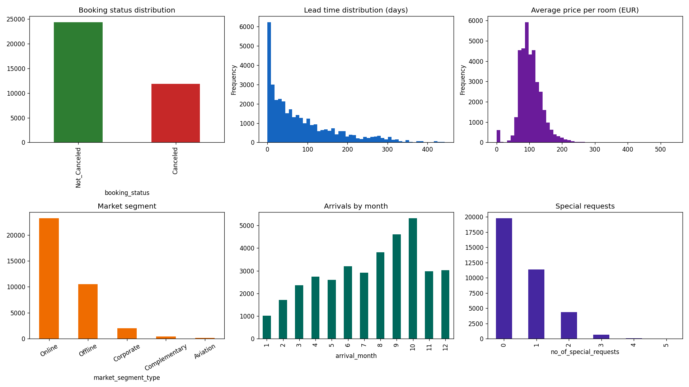

# Data Quality Report

**Dataset:** `hotel_reservations.csv` — 36,275 rows x 19 columns
**Source:** Hotel Reservations dataset (Kaggle)

## 1. Structure

- Rows: **36,275**
- Columns: **19** (1 identifier, 12 numeric, 5 categorical)
- No Jupyter notebooks used; audit produced with `scripts/p1_data_audit.py`.

## 2. Missing values

No missing values in any column.

## 3. Duplicated rows

- Fully duplicated rows: **0**
- Duplicated `Booking_ID`: **0**

## 4. Constant columns

None.

## 5. Data type issues

- All numeric columns are stored as int64/float64; categoricals as string.
- `arrival_year`/`arrival_month`/`arrival_date` are stored as integers, not as a single datetime column.
- `repeated_guest`, `required_car_parking_space` are 0/1 flags stored as integers (valid).
- **Issue:** no booking-creation date exists, so a true booking timestamp cannot be reconstructed.

## 6. Outliers (IQR rule)

| Column | Outliers | % | Min | Max |
| --- | --- | --- | --- | --- |
| no_of_adults | 10,167 | 28.03% | 0.0 | 4.0 |
| no_of_children | 2,698 | 7.44% | 0.0 | 10.0 |
| no_of_weekend_nights | 21 | 0.06% | 0.0 | 7.0 |
| no_of_week_nights | 324 | 0.89% | 0.0 | 17.0 |
| required_car_parking_space | 1,124 | 3.1% | 0.0 | 1.0 |
| lead_time | 1,331 | 3.67% | 0.0 | 443.0 |
| repeated_guest | 930 | 2.56% | 0.0 | 1.0 |
| no_of_previous_cancellations | 338 | 0.93% | 0.0 | 13.0 |
| no_of_previous_bookings_not_canceled | 812 | 2.24% | 0.0 | 58.0 |
| avg_price_per_room | 1,696 | 4.68% | 0.0 | 540.0 |
| no_of_special_requests | 761 | 2.1% | 0.0 | 5.0 |

## 7. Class imbalance

| booking_status | count | % |
| --- | --- | --- |
| Not_Canceled | 24,390 | 67.2% |
| Canceled | 11,885 | 32.8% |

Moderate imbalance (1:2.05). Mitigation (class weights / resampling) and PR-AUC should be considered for classification.

## 8. Specific quality findings

- `avg_price_per_room == 0`: **545** rows — consistent with Complementary market segment (free stays).
- Bookings with 0 total nights: **78** rows — anomalous, candidate for removal or flagging.
- Bookings with 0 adults and 0 children: **0** rows — anomalous.
- `no_of_children` in (9, 10): **3** rows — implausible values, likely data-entry errors.
- `type_of_meal_plan == 'Meal Plan 3'`: only **5** rows — rare category, candidate for grouping.
- `room_type_reserved == 'Room_Type 3'`: only **7** rows — rare category, candidate for grouping.

## 9. Temporal coverage

- Arrival years: [2017, 2018]
- Months: 1–12 (full coverage)
- Granularity: daily (arrival_year, arrival_month, arrival_date); no booking-date column available
- Note: The dataset lacks a booking-creation timestamp; only arrival dates are available.

## 10. PII / sensitive columns inventory

| Column | Sensitive | Category | Recommended handling |
| --- | --- | --- | --- |
| Booking_ID | No | Pseudonymous identifier | Keep as key; exclude from features |
| repeated_guest | No | Behavioral | Keep |

No direct PII (names, emails, phones, payments, nationality) is present. `Booking_ID` is pseudonymous and must never be used as a model feature.

## 11. Basic distributions

|                                      |   mean |   std |   min |   50% |   max |
|:-------------------------------------|-------:|------:|------:|------:|------:|
| no_of_adults                         |   1.84 |  0.52 |     0 |  2    |     4 |
| no_of_children                       |   0.11 |  0.4  |     0 |  0    |    10 |
| no_of_weekend_nights                 |   0.81 |  0.87 |     0 |  1    |     7 |
| no_of_week_nights                    |   2.2  |  1.41 |     0 |  2    |    17 |
| required_car_parking_space           |   0.03 |  0.17 |     0 |  0    |     1 |
| lead_time                            |  85.23 | 85.93 |     0 | 57    |   443 |
| arrival_month                        |   7.42 |  3.07 |     1 |  8    |    12 |
| arrival_date                         |  15.6  |  8.74 |     1 | 16    |    31 |
| repeated_guest                       |   0.03 |  0.16 |     0 |  0    |     1 |
| no_of_previous_cancellations         |   0.02 |  0.37 |     0 |  0    |    13 |
| no_of_previous_bookings_not_canceled |   0.15 |  1.75 |     0 |  0    |    58 |
| avg_price_per_room                   | 103.42 | 35.09 |     0 | 99.45 |   540 |
| no_of_special_requests               |   0.62 |  0.79 |     0 |  0    |     5 |

## 12. Initial hypotheses

- H1: Longer lead times are associated with higher cancellation probability (plans change over long horizons).
- H2: Online segment bookings cancel more than Offline/Corporate segments.
- H3: Bookings with special requests cancel less (higher guest commitment).
- H4: Repeated guests with clean history cancel far less than first-time guests.
- H5: Higher average price per room increases cancellation probability.
- H6: Cancellations concentrate in specific arrival months (seasonality).
- H7: Guests with previous cancellations are more likely to cancel again (behavioral persistence).

## 13. Recommendations

1. Keep all rows (no missing/duplicates); flag or drop the 78 zero-night and 0 zero-guest anomalies after business confirmation.
2. Cap or bin extreme `lead_time` (> 400 days) only after checking its predictive value.
3. Treat `no_of_children` values 9–10 as data-entry noise; consider capping at 3.
4. Group rare categories (`Meal Plan 3`, `Room_Type 3`) into "Other" during preprocessing.
5. Exclude `Booking_ID` from features; do not use it for modeling.
6. For any time-based split, note that only arrival dates exist (no booking timestamps).
