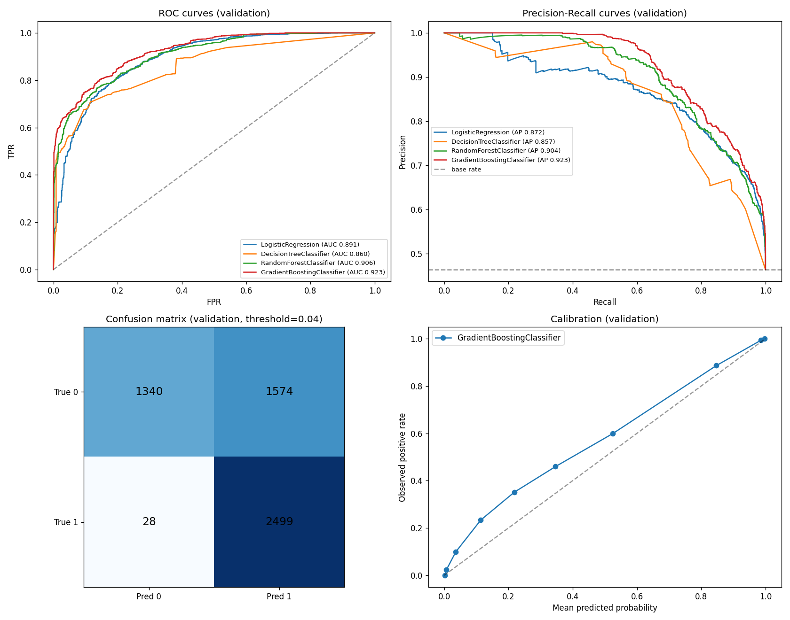
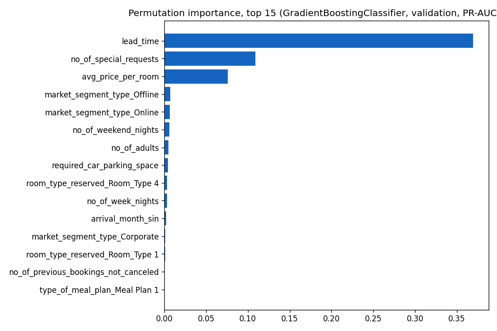
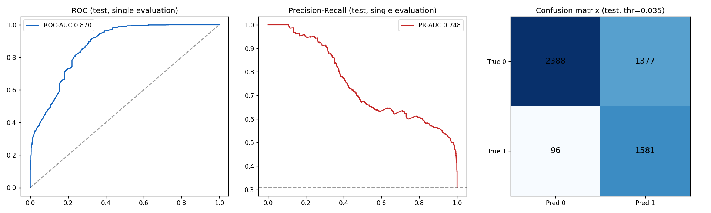

# Model Report

## 1. Problem and target

Binary classification on **`booking_status`** (Canceled=1 vs Not_Canceled=0). The target is the
outcome recorded by the hotel: it is realized revenue loss when the guest cancels. Regression
alternatives were discarded because the business action (retain or reallocate) triggers on a
cancellation event, not on a continuous outcome.

## 2. Data and split

- **Split: time-based, ordered by arrival date** (70% / 15% / 15%).
  - Train: 25,392 rows (Jul 2017 → Aug 2018), positive rate 30.2%
  - Validation: 5,441 rows (Aug → Oct 2018), positive rate **46.4%**
  - Test: 5,442 rows (Oct → Dec 2018), positive rate 30.8%
- Justification: with no booking-creation timestamp, arrival date is the best temporal proxy;
  a time-based split mimics production (train on the past, score the future).
- **Documented drift:** validation covers the high season with a materially higher cancellation
  rate than train. This is realistic and explains the validation→test metric gap.
- `arrival_year` and `arrival_date` are used for the split only, excluded from features (year drift,
  day-of-month noise). Month enters as a cyclic encoding (below).

## 3. Features and preprocessing

- Engineered: `total_nights` (week + weekend nights) and **cyclic encoding of the arrival month**
  (`arrival_month_sin`/`arrival_month_cos`), which lets tree models place winter and summer as
  neighbors instead of opposite ends of a linear scale.
- Rare categories grouped: `Meal Plan 3 → Other`, `Room_Type 3 → Other`.
- Numeric: median imputer + standard scaler; categorical: most-frequent imputer + one-hot
  (`handle_unknown="ignore"`). **Fit on train only** — and re-fit inside every cross-validation
  fold to avoid leakage into the fold holdout.
- Excluded: `Booking_ID` (identifier), `booking_status` (label), `arrival_year`, `arrival_date`.

## 4. Baseline

Majority-class baseline (always "Not_Canceled"): validation accuracy 0.536, F1 0.0 — trivially
useless for the business objective, as expected under the 46.4% validation positive rate.

## 5. Candidate models and cross-validation

StratifiedKFold (5 folds, shuffle, seed 42) on train; **the full pipeline (imputation, scaling,
one-hot, model) is fit inside each fold**. Class imbalance handled with
`class_weight="balanced"` (LR/DT/RF) or balanced `sample_weight` (GB). Primary CV metric: PR-AUC.

| Model | Best params | CV PR-AUC (mean) | Val PR-AUC | Val ROC-AUC |
| --- | --- | --- | --- | --- |
| LogisticRegression | C=0.1 | 0.730 | 0.872 | 0.891 |
| DecisionTreeClassifier | depth=15, leaf=20 | 0.860 | 0.857 | 0.860 |
| RandomForestClassifier | 400 trees, depth=None, leaf=2 | 0.909 | 0.904 | 0.906 |
| **GradientBoostingClassifier** | 400 est, lr=0.1, depth=5 | 0.907 | **0.923** | **0.923** |

**Selected: GradientBoostingClassifier** (highest validation PR-AUC, the business-aligned metric
for imbalanced data). Full results: `docs/json/candidate_cv_results.json`.

## 6. Decision threshold (validation only)

Optimized on validation with the cost matrix (FN=10, FP=1 from `configs/business_rules.json`):

- **Chosen threshold: 0.035** — expected cost 1,854 vs 8,200 at the default 0.5 (4.4x reduction).
- Business rationale: with FN 10x costlier than FP, the optimal operating point accepts many false
  alarms (precision 0.61) to catch 98.9% of true cancellations (recall). Every flagged booking
  receives a graded action via the risk bands, so false alarms mostly trigger cheap reconfirmations.
- Bands from `configs/business_rules.json` (low < threshold, medium < 0.55, high ≥ 0.55) provide
  the graded response; the threshold is the "act vs no action" cut, so the predicted label and the
  risk band are always consistent.

## 7. Global feature importance (permutation, validation)

Top drivers: `lead_time` (0.370), `no_of_special_requests` (0.109), `avg_price_per_room` (0.076),
`market_segment_type_Offline` (0.007), `market_segment_type_Online` (0.007) — consistent with the
business analysis insights. Full list: `docs/json/feature_importance.json`.

## 8. Local explanations

SHAP TreeExplainer persisted at `models/explainer.joblib` (with feature names), fitted on a 500-row
train background sample. The API uses it for top-k contributing factors per prediction.

## 9. Final test evaluation (exactly once)

| Metric | Validation | Test |
| --- | --- | --- |
| ROC-AUC | 0.923 | **0.870** |
| PR-AUC | 0.923 | **0.748** |
| Accuracy (thr 0.035) | 0.706 | 0.729 |
| Precision | 0.614 | 0.535 |
| Recall | 0.989 | 0.943 |
| F1 | 0.757 | 0.682 |
| Brier | 0.117 | 0.164 |
| Confusion (tn/fp/fn/tp) | 1340/1574/28/2499 | 2388/1377/96/1581 |

**Interpretation:** the validation→test gap is explained by temporal drift: validation covers the
high-cancellation season (Aug–Oct, 46.4% positives) while test covers Oct–Dec (30.8%). The model
still catches 94.3% of true cancellations in unseen future data at the cost-oriented threshold.
Calibration degrades out-of-season (Brier 0.164); recalibration on rolling windows is recommended
before production use.

## 10. Notes and limitations

- Single anonymized hotel; 2017–2018 only; no booking-creation timestamps.
- Guest-history features assume production lookups exist.
- Threshold is cost-policy-dependent; recompute if the cost matrix changes.
