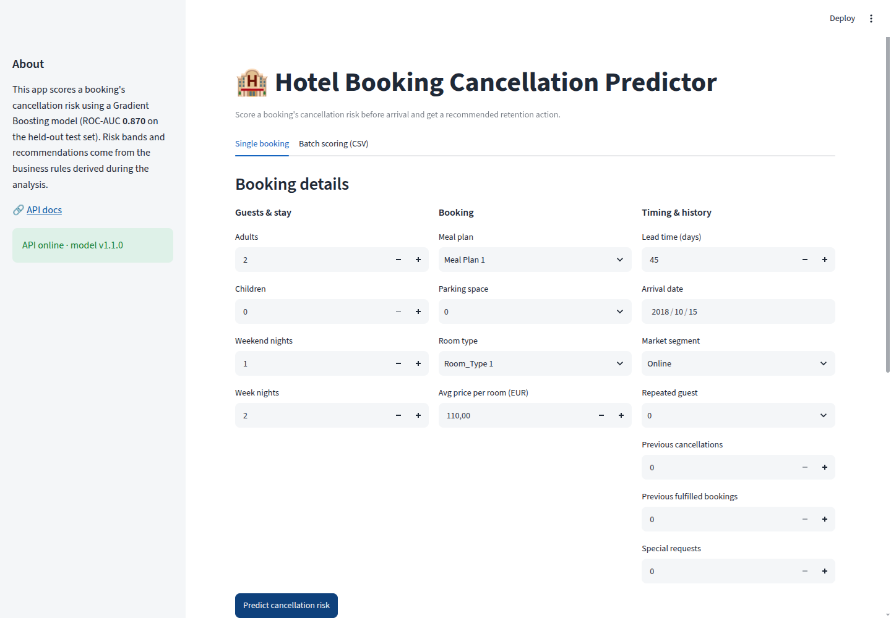

# Predict App Documentation

**Location:** `apps/predict_app/app.py` · **Port:** 8501 · **Framework:** Streamlit



## Purpose

Operational tool for hotel staff to score bookings' cancellation risk before arrival
and receive the business-recommended action.

## Single booking tab

1. Fill the form with the booking's details (party size, nights, meal plan, room type, lead time,
   arrival date, market segment, guest history, price, special requests).
2. The API validates business rules (at least one guest, at least one night, valid dates) and
   returns 422 for invalid bookings.
3. Press **Predict cancellation risk**.

### Output


- **Cancellation risk gauge** (0–100%) with the band thresholds colored.
- **Risk band** (low / medium / high) color-coded, consistent with the predicted label
  (low band ⟺ label Not_Canceled).
- **Recommended action** from `configs/business_rules.json`:
  - low → no action needed
  - medium → proactive reconfirmation + flexible-date incentive
  - high → immediate retention workflow (personal contact, deposit, inventory review)
- **Main contributing factors:** top-5 SHAP contributions as a signed horizontal bar
  (red → cancels, green → keeps).
- A warning appears when the arrival date falls outside the training period (Jul 2017 – Dec 2018).

## Batch scoring tab

- Upload a CSV with one booking per row (template download available).
- The app scores rows in chunks of 100 (the API's batch limit) with a progress bar.
- The scored table can be downloaded as `bookings_scored.csv` with probability, label,
  risk band, and recommendation per booking.

## API connection

- Reads `API_URL` from the environment (default `http://localhost:8000`; set to `http://api:8000`
  inside Docker Compose).
- Sidebar shows the API status and model version (`GET /health`).
- Calls `POST /v1/predict`; API errors are surfaced with `st.error`.

## Run locally

```bash
make run-api          # terminal 1
make run-predict-app  # terminal 2 → http://localhost:8501
```
