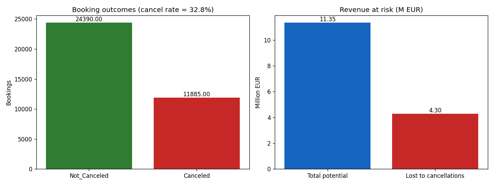

# Q01 Output — Overall cancellation rate and revenue at risk

**Question:** What is the overall cancellation rate and how much revenue is at risk?

```
Total bookings:          36,275
Canceled bookings:       11,885
Cancellation rate:       32.76%
Total potential revenue: EUR 11.35M
Lost to cancellations:   EUR 4.30M  (37.9% of potential)
Avg booking value:       EUR 289

Cancellation rate by year:
                mean   size
arrival_year               
2017          0.1475   6514
2018          0.3671  29761
```


