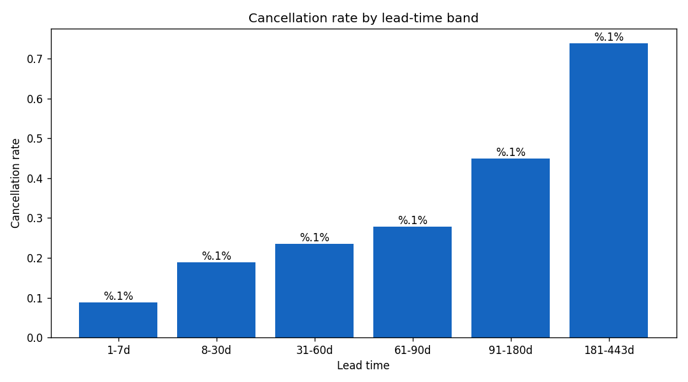

# Q02 Output — Lead time vs cancellation

**Question:** How does lead time affect cancellation probability?

```
Cancellation rate by lead-time band:
                  mean  size
lead_time_band              
1-7d            0.0886  5801
8-30d           0.1890  6610
31-60d          0.2347  6307
61-90d          0.2780  4508
91-180d         0.4490  7772
181-443d        0.7389  5277

Point-biserial correlation (lead_time, cancel): 0.439
```

**Interpretation:** The relationship is strong and monotonic. Guests booking far in advance
(181-443 days) cancel at ~74%, while last-minute bookers (<=7 days) cancel at ~10%.
Long-lead bookings are the natural target for proactive interventions.


