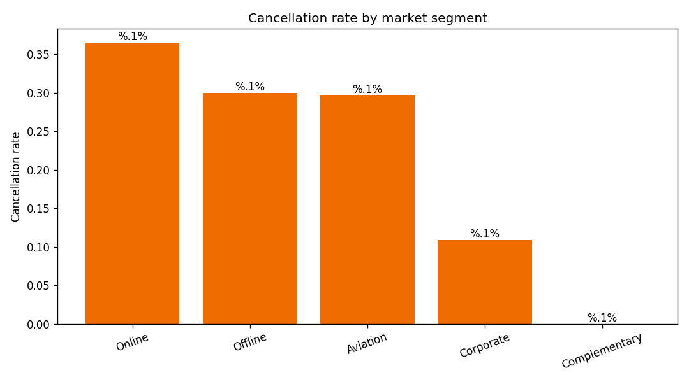

# Q03 Output — Market segment behavior

**Question:** How do market segments differ in cancellation behavior?

```
                     cancellation_rate      n  avg_price
market_segment_type                                     
Online                          0.3651  23214   112.2569
Offline                         0.2995  10528    91.6327
Aviation                        0.2960    125   100.7040
Corporate                       0.1091   2017    82.9117
Complementary                   0.0000    391     3.1418
```

**Interpretation:** Online dominates volume (23,214 bookings, 64%) and shows the highest
cancellation rate (~37%) — a channel-risk concentration. Corporate (~11%) and Complementary
(0%) are the safest segments. Channel-specific policies (e.g., stricter online payment terms)
are a high-leverage lever.


