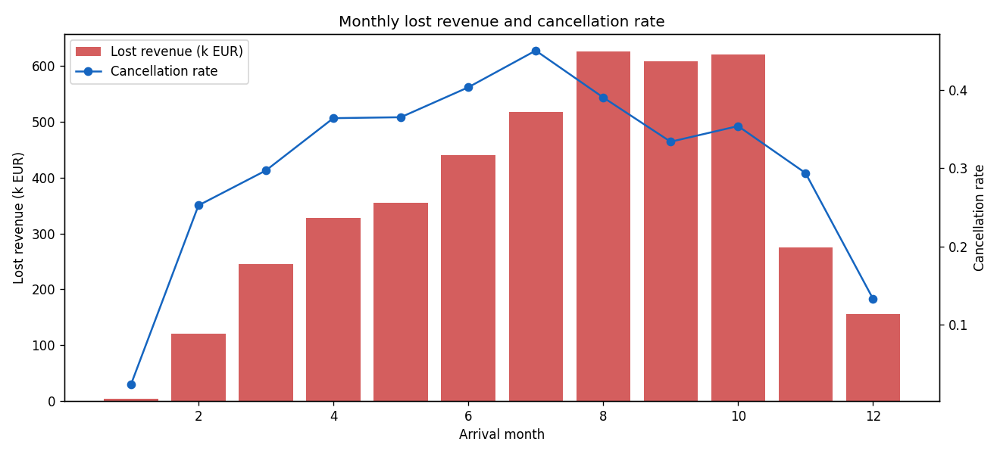

# Q04 Output — Revenue impact of cancellations by month

**Question:** What is the revenue impact of cancellations by arrival month?

```
Total lost revenue: EUR 4.30M

Top-3 loss months:
               bookings  cancellation_rate  lost_revenue
arrival_month                                           
8                  3813               0.39     626128.28
10                 5317               0.35     620595.67
9                  4611               0.33     607844.67

Top-3 months share of total lost revenue: 43.2%
```

**Interpretation:** Losses concentrate in peak-demand months (highest absolute lost revenue in
months with the most bookings). Protecting revenue in these months (overbooking buffers,
deposits, proactive reconfirmation) has the highest financial leverage.


