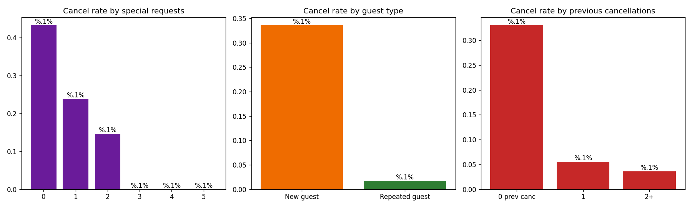

# Q05 Output — Engagement and loyalty signals

**Question:** Do engagement and loyalty signals reduce cancellation probability?

```
Cancel rate by number of special requests:
                          mean   size
no_of_special_requests               
0                       0.4321  19777
1                       0.2377  11373
2                       0.1460   4364
3                       0.0000    675
4                       0.0000     78
5                       0.0000      8

Cancel rate by guest type:
                  mean   size
repeated_guest               
0               0.3358  35345
1               0.0172    930

Cancel rate by previous cancellations (2+ clipped):
                                mean   size
no_of_previous_cancellations               
0                             0.3303  35937
1                             0.0556    198
2                             0.0357    140

Correlation (special requests, cancel): -0.253
```

**Interpretation:** Engagement is strongly protective. Bookings with 0 special requests cancel
at 43%; with 3+ requests, effectively never. Repeated guests cancel at 1.7% (vs 33.6% for new
guests). These signals are cheap to collect at booking time and highly actionable
(priority reconfirmation for zero-request, first-time, long-lead bookings).


